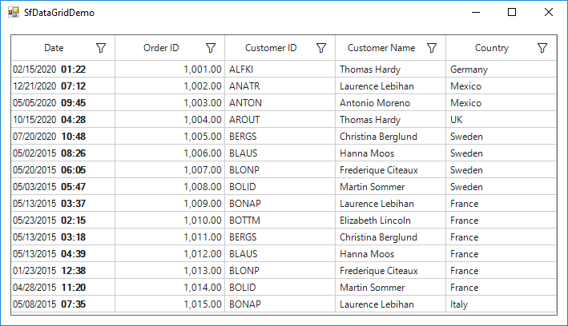

# How to show two format in GridDateTimeColumn in WinForms DataGrid (SfDataGrid)?

## About the sample
This example illustrates how to show two format in GridDateTimeColumn in WinForms DataGrid (SfDataGrid)

By default, [SfDataGrid](https://help.syncfusion.com/cr/cref_files/windowsforms/Syncfusion.SfDataGrid.WinForms~Syncfusion.WinForms.DataGrid.SfDataGrid.html) does not provide the direct support for display datetime value in two format in [GridDateTimeColumn](https://help.syncfusion.com/cr/cref_files/windowsforms/Syncfusion.SfDataGrid.WinForms~Syncfusion.WinForms.DataGrid.GridDateTimeColumn.html#%22%22). You can achieve this by overriding [OnRender](https://help.syncfusion.com/cr/cref_files/windowsforms/Syncfusion.SfDataGrid.WinForms~Syncfusion.WinForms.DataGrid.Renderers.GridDateTimeCellRenderer~OnRender.html)  method in [GridDateTimeCellRenderer](https://help.syncfusion.com/cr/cref_files/windowsforms/Syncfusion.SfDataGrid.WinForms~Syncfusion.WinForms.DataGrid.Renderers.GridDateTimeCellRenderer.html#%22%22). 

```C#

this.sfDataGrid.CellRenderers.Remove("DateTime");
this.sfDataGrid.CellRenderers.Add("DateTime", new GridDateTimeCellRendererExt());

public class GridDateTimeCellRendererExt : GridDateTimeCellRenderer
{
     protected override void OnRender(Graphics paint, Rectangle cellRect, string cellValue, CellStyleInfo style, DataColumnBase column, RowColumnIndex rowColumnIndex)
     {
        string[] date = cellValue.Split();
        SizeF size = paint.MeasureString(date[0], style.Font.GetFont());
        float height = (cellRect.Height - size.Height) / 2;
        paint.DrawString(date[0], style.Font.GetFont(), new SolidBrush(style.TextColor), cellRect.X, cellRect.Y + height);
        paint.DrawString(date[1], new Font(style.Font.Facename, style.Font.Size, FontStyle.Bold), new SolidBrush(style.TextColor), cellRect.X + size.Width, cellRect.Y + height);
     }
}

```

The following screenshot shows the two formats in GridDateTimeColumn,



## Requirements to run the demo
Visual Studio 2015 and above versions


